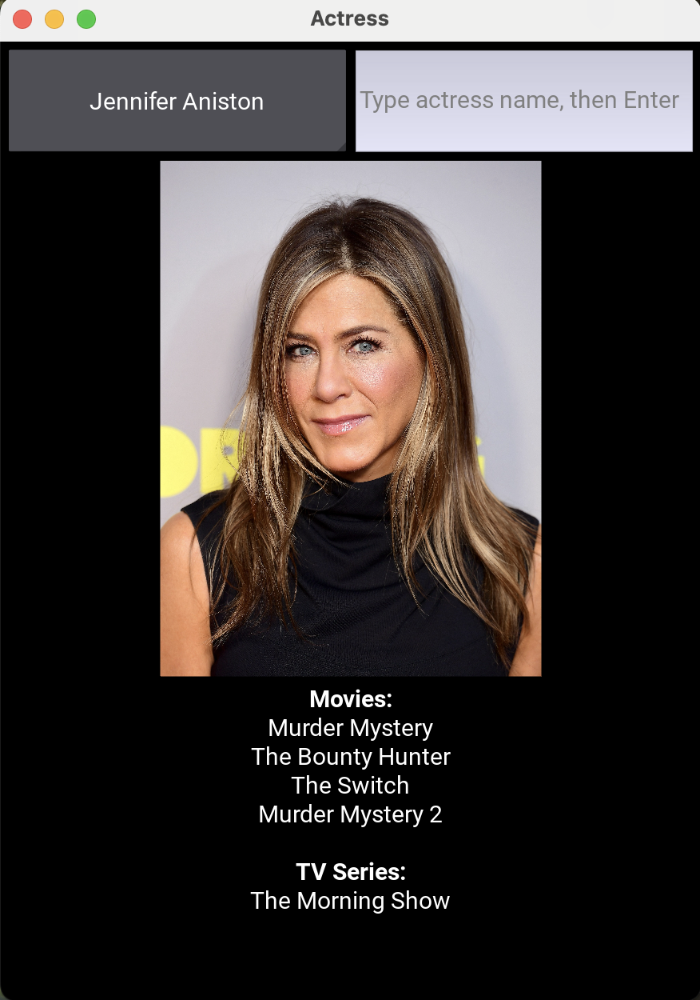

# Actress  

There are too many movies and TV series to watch, making it hard to choose. To help with this, I built *Actress*, a desktop app focused only on actresses (no male actors).  

## The rationale  
If I enjoy an actress’s performance, I tend to watch more of her work. This serves as a filter:  

> If your acting impressed me in one movie or series, I’m likely to enjoy another you’re in.  

## What the app does  
When launched, the app prompts you to enter an actress’s name or select one from a dropdown list.  

- Selecting a name displays her image along with movies/series she has been in.  
- Typing a name requires pressing `Enter` to display the image.  

Here's the display for a successful search.

## How I use the app  
When unsure what to watch, I open the app, pick an actress, and recall my past viewing experiences by seeing her face. Then, I search for her name on Google (e.g., `Jennifer Aniston movies`) to find more titles beyond what's in my database.  

## Development environment  
Built with Python and SQLite, using VSCode as the text editor.  

See `requirements.txt` for dependencies.  

## The dataset  
The dataset I used is proprietary, so it's not included in the GitHub repo. However, a dummy dataset with a few records is provided for you to populate with your own data.

## Running the scripts
Run the scripts in this order:
1. `get-images.py`
1. `setup-db.py`
1. `app.py`

## Creating the desktop app
Run the following command in the terminal to generate a desktop app, allowing you to open it by clicking an icon instead of running the Python script:
`pyinstaller --noconfirm --windowed --name "ActressApp" --add-data "actress_images:actress_images" --add-data "actresses.db:." app.py`

- If you're using a Mac, this will create two directories `build` and `dist`. Open `dist` and you'll see an app icon named `ActressApp`. Double click it and the app should open.
- If you're using a Windows machine, run this script instead:
`pyinstaller --noconfirm --windowed --name "ActressApp" --add-data "actress_images;actress_images" --add-data "actresses.db;." app.py`
and open the `.exe` file.

## Future work  
1. Display actress ages.  
1. Connect to IMDb to distinguish watched vs. unwatched movies.  

## Check out my website
[www.conterval.com](https://www.conterval.com/)
